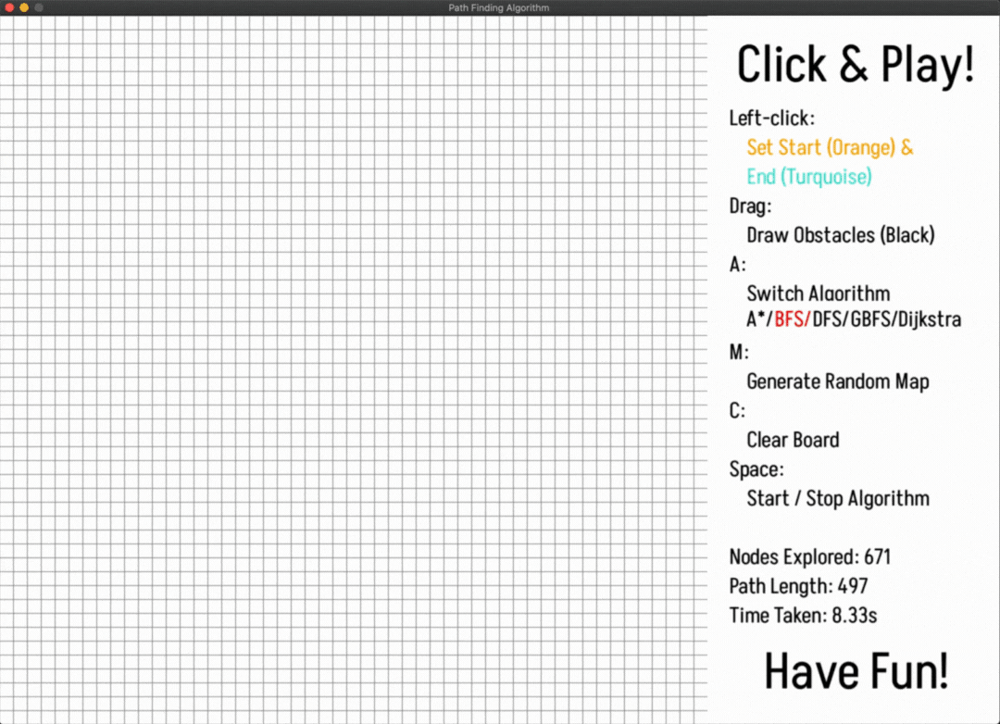

# Path Finding Algorithm Visualizer


## Overview
This project is a visualizer for various pathfinding algorithms implemented using Pygame. It allows users to interactively set obstacles, start and end points, and observe how different algorithms navigate through them to find the shortest path.

## Installation

clone the repository:

```bash
git clone https://github.com/abouabra/Path-Finding-Visualizer.git
```

change the directory to the cloned repository.
```bash
cd Path-Finding-Visualizer
```

Use the package manager [pip](https://pip.pypa.io/en/stable/) to install the required libraries.
```bash
pip install -r requirements.txt
```

## Usage

### Run the game:

``` bash
    python main.py
```


### Interact with the game:
    Left-click to set the start point (orange) and end point (turquoise), and draw obstacles (black) by dragging the mouse.
    Press keys for additional functionality:
        A: Switch between different algorithms (A*, BFS, DFS, GBFS, Dijkstra).
        M: Generate a random maze.
        C: Clear the board.
        Space: Start/stop the selected algorithm.
        Esc: Quit the game.

## Features

- Dynamic Visualization: Watch as the chosen algorithm navigates through obstacles to find the shortest path from the start to the end point.

- Multiple Algorithms: Choose from a variety of pathfinding algorithms, including :
```txt
    A* (A-star)
    BFS (Breadth-First Search)
    DFS (Depth-First Search)
    GBFS (Greedy Best-First Search)
    Dijkstra (Dijkstra's Algorithm)
```

- Maze Generation: Generate a random maze to test the algorithms' performance in complex environments.

## Usage

To run the game, simply run the main.py file.

```bash
python PathFindingVisualizer.py
```

## Contributing
Contributions are welcome! If you'd like to add new features, improve existing ones, or fix bugs, feel free to open a pull request.


